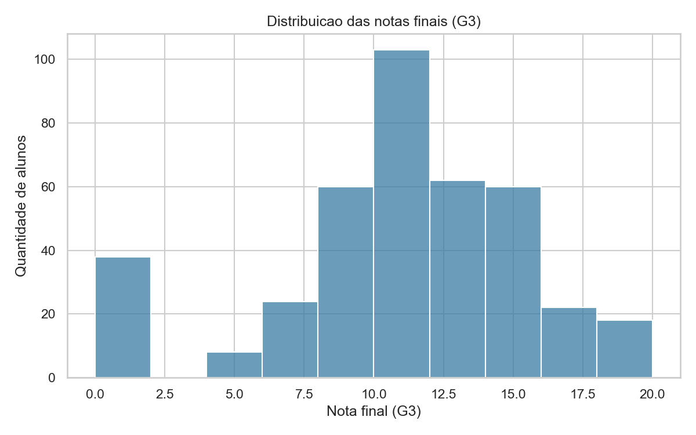
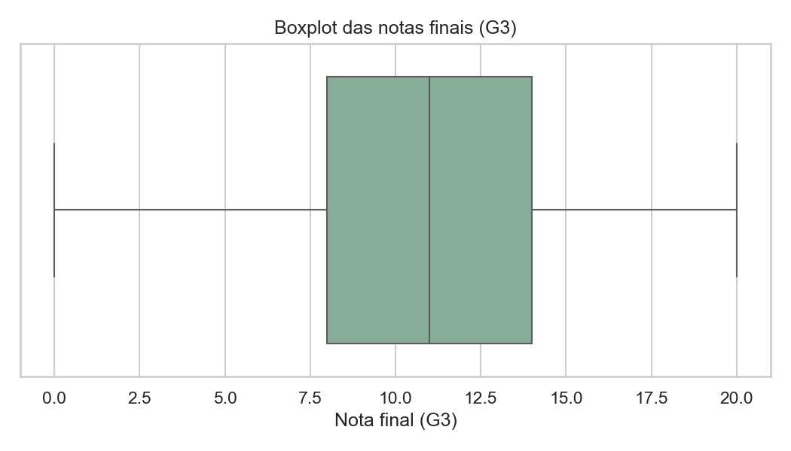
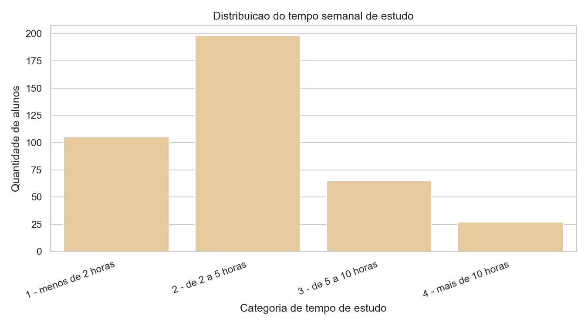
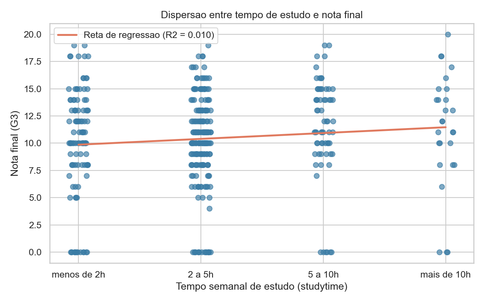

# Desempenho Acadêmico: alunos que estudam por mais horas têm melhores notas?

### Desenvolvido por: 
#### Alana Silva Sales
#### Guilherme Leitão Bastos
#### Marcelo Antônio Dantas Filho
#### Marcos Martenier Santos Oliveira

---

## Introdução

Este projeto, desenvolvido para a disciplina de Probabilidade e Estatística, no curso de Engenharia de Computação, apresenta uma análise exploratória de dados sobre desempenho acadêmico, com foco na relação entre tempo semanal de estudo e nota final dos alunos.

A pergunta central do estudo é:

**Alunos que estudam por mais horas tendem a obter melhores notas finais?**

Para responder a essa pergunta, foi utilizada uma base de dados real, a **Student Performance**, disponibilizada pela UCI Machine Learning Repository. A análise foi desenvolvida em Python, com uso de estatística descritiva, visualizações, correlação e regressão linear simples.

## Base de dados

Este projeto utiliza o arquivo `student-mat.csv`, referente ao desempenho de alunos na disciplina de Matematica.

Fonte da base:

https://archive.ics.uci.edu/dataset/320/student+performance

O arquivo da base está localizado em:

```text
data/student-mat.csv
```

Caso seja necessário baixar novamente:

1. Acesse a página da base na UCI.
2. Baixe os arquivos da base **Student Performance**.
3. Extraia o arquivo `student-mat.csv`.
4. Coloque o arquivo dentro da pasta `data/`.

## Variáveis analisadas

A análise utiliza duas variaveis principais:

- `studytime`: tempo semanal de estudo, representado por categorias ordinais.
- `G3`: nota final do aluno em Matemática, em escala de 0 a 20.

As categorias de `studytime` são:

| Codigo | Interpretação |
| --- | --- |
| 1 | menos de 2 horas |
| 2 | de 2 a 5 horas |
| 3 | de 5 a 10 horas |
| 4 | mais de 10 horas |

## Objetivo

O objetivo do projeto é investigar se existe associação entre o tempo semanal de estudo e o desempenho final dos alunos. Para isso, busca-se observar a distribuição das notas, a frequência das categorias de estudo, a relação visual entre as variáveis e a força estatística dessa relação.

O estudo não tem como objetivo provar causalidade. Ou seja, mesmo que exista alguma tendência positiva, não é possivel afirmar apenas com esses dados que estudar mais causa diretamente notas maiores, já que fatores externos também podem influenciar o desempenho acadêmico.

## Como a análise foi feita

O arquivo `analise_student.py` executa as seguintes etapas:

- carregamento da base de dados;
- seleção das variáveis `studytime` e `G3`;
- verificação de tipos e valores nulos;
- limpeza básica dos dados;
- calculo de estatísticas descritivas;
- geração de histogramas, boxplot, gráfico de barras e gráfico de dispersão;
- cálculo da correlação de Pearson;
- ajuste de regressão linear simples;
- cálculo do coeficiente de determinação, `R2`.

## Estrutura do projeto

```text
.
|-- analise_student.py
|-- requirements.txt
|-- data/
|   |-- student-mat.csv
|-- outputs/
|   |-- histograma_g3.png
|   |-- boxplot_g3.png
|   |-- barras_studytime.png
|   |-- dispersao_regressao_studytime_g3.png
```

## Como instalar as dependências

```bash
pip install -r requirements.txt
```

Se estiver usando ambiente virtual:

```bash
python -m venv .venv
.\.venv\Scripts\activate
pip install -r requirements.txt
```

## Como executar

```bash
python analise_student.py
```

Ou, usando diretamente a `venv` no Windows:

```bash
.\.venv\Scripts\python.exe analise_student.py
```

## Resultados descritivos

A base analisada possui **395 alunos** e não apresentou valores nulos nas variáveis selecionadas.

Resumo das principais medidas:

| Variável | Média | Mediana | Moda | Desvio padrão | Mínimo | Máximo |
| --- | ---: | ---: | ---: | ---: | ---: | ---: |
| `studytime` | 2.04 | 2.00 | 2 | 0.84 | 1 | 4 |
| `G3` | 10.42 | 11.00 | 10 | 4.58 | 0 | 20 |

A categoria de tempo de estudo mais frequente foi **2 - de 2 a 5 horas**. A faixa de notas mais comum foi **10 a 14**.

## Visualizações e interpretações

### Histograma das notas finais



O histograma mostra a distribuição das notas finais `G3`. A maior concentração de alunos aparece em notas intermediárias, especialmente entre 10 e 14 pontos. Também existem notas muito baixas, inclusive valores proximos de 0, o que mostra uma dispersão considerável no desempenho.

### Boxplot das notas finais



O boxplot resume a distribuição da nota final. A mediana está em torno de 11, indicando que metade dos alunos ficou abaixo desse valor e metade acima. A caixa concentra a parte central dos dados, aproximadamente entre 8 e 14 pontos, enquanto as hastes mostram a variação geral das notas.

``` text
O gráfico aparece dessa forma porque `G3` é uma variável numérica em escala de 0 a 20. Como muitos alunos estão concentrados em notas intermediárias, a caixa fica posicionada no centro da escala. A presença de notas baixas amplia a variação inferior da distribuição.
```

### Distribuição do tempo semanal de estudo



O gráfico de barras mostra quantos alunos existem em cada categoria de `studytime`. A maior parte dos estudantes está na categoria 2, equivalente a 2 a 5 horas semanais de estudo. As categorias 3 e 4 possuem menos alunos, especialmente a categoria 4, com mais de 10 horas semanais.

Essa visualização ajuda a entender que a amostra não está igualmente distribuída entre os grupos de tempo de estudo. Portanto, comparações entre categorias devem considerar que algumas possuem muito menos observações do que outras.

### Dispersão entre tempo de estudo e nota final



O gráfico de dispersão relaciona `studytime`, no eixo horizontal, com `G3`, no eixo vertical. Os pontos aparecem organizados em quatro colunas porque `studytime` não representa horas exatas, mas categorias numéricas de 1 a 4.

Cada ponto representa um aluno. Como vários alunos pertencem à mesma categoria de tempo de estudo, muitos pontos ficam alinhados verticalmente. O pequeno deslocamento horizontal aplicado no gráfico facilita a visualização e reduz a sobreposição dos pontos.

A reta de regressão apresenta leve inclinação positiva, indicando uma tendência de aumento da nota conforme cresce a categoria de tempo de estudo. Entretanto, os pontos estão bastante espalhados em todas as categorias, o que sugere que a relação entre as variáveis é fraca.

## Correlação e regressão linear

A correlação de Pearson entre `studytime` e `G3` foi:

```text
r = 0.098
```

Esse valor indica uma correlação positiva, porém **fraca**. Em termos práticos, existe uma pequena tendência de que alunos em categorias maiores de estudo tenham notas um pouco maiores, mas essa relação nao é intensa.

A regressão linear simples estimada foi:

```text
G3 = 9.328 + 0.534 * studytime
```

O coeficiente angular da regressão indica que, para cada aumento de uma categoria em `studytime`, a nota final prevista aumenta em aproximadamente **0.53 ponto**.

O coeficiente de determinação foi:

```text
R2 = 0.010
```

Isso significa que o tempo semanal de estudo explica aproximadamente **1,0% da variacao observada nas notas finais**. Assim, embora a tendência seja positiva, o poder explicativo da variável `studytime` é muito baixo quando analisada isoladamente.

Também é importante observar que `studytime` é uma variável ordinal agrupada em faixas de horas. Por isso, a regressão deve ser interpretada como uma tendência geral entre categorias, e não como uma medida exata do efeito de cada hora adicional de estudo.

## Considerações finais

A analise realizada indica que há uma associação positiva entre tempo semanal de estudo e nota final, mas essa associação é fraca. Os alunos que declaram estudar por mais tempo apresentam, em média, notas ligeiramente maiores, especialmente nas categorias de 5 a 10 horas e mais de 10 horas semanais. No entanto, a diferença observada não é suficientemente forte para afirmar que o tempo de estudo, sozinho, seja um fator determinante do desempenho acadêmico.

O baixo valor de `R2` mostra que a maior parte da variação das notas finais não é explicada apenas por `studytime`. Isso sugere que outros fatores presentes na base, como notas anteriores, faltas, apoio familiar, histórico de reprovações, contexto social e escolar, podem ter papel relevante na explicação do desempenho dos estudantes.

Dessa forma, o estudo contribui para compreender que estudar mais pode estar associado a melhores resultados, mas essa relação deve ser analisada com cautela. No conjunto de dados observado, o tempo de estudo apresenta uma tendência favorável, porém limitada. Para uma conclusão mais completa, seria adequado ampliar a análise incluindo outras variáveis explicativas e comparando modelos estatísticos mais abrangentes.

Portanto, com base nesta análise exploratória, conclui-se que alunos que estudam por mais horas tendem a apresentar notas um pouco maiores, mas o tempo de estudo isoladamente não explica de forma significativa o desempenho acadêmico final.
